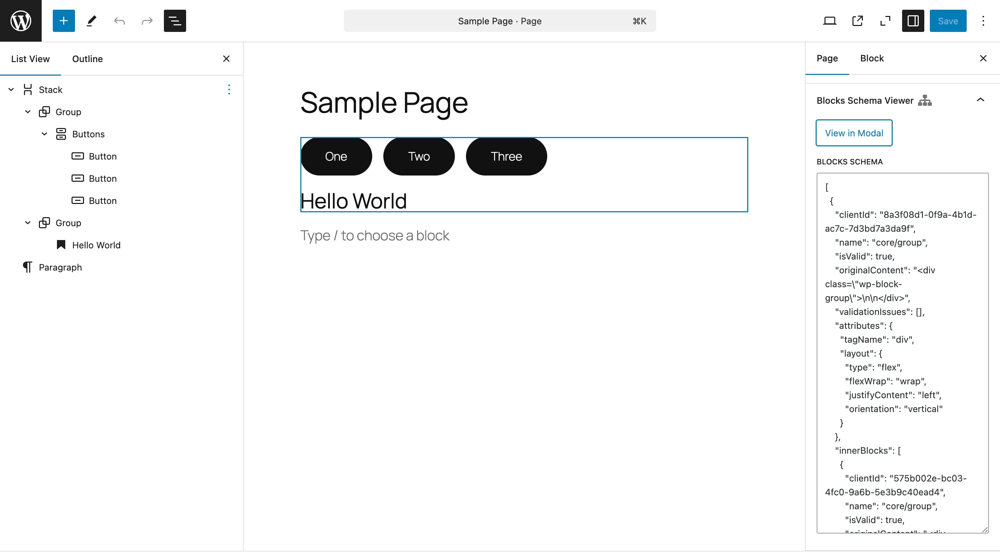
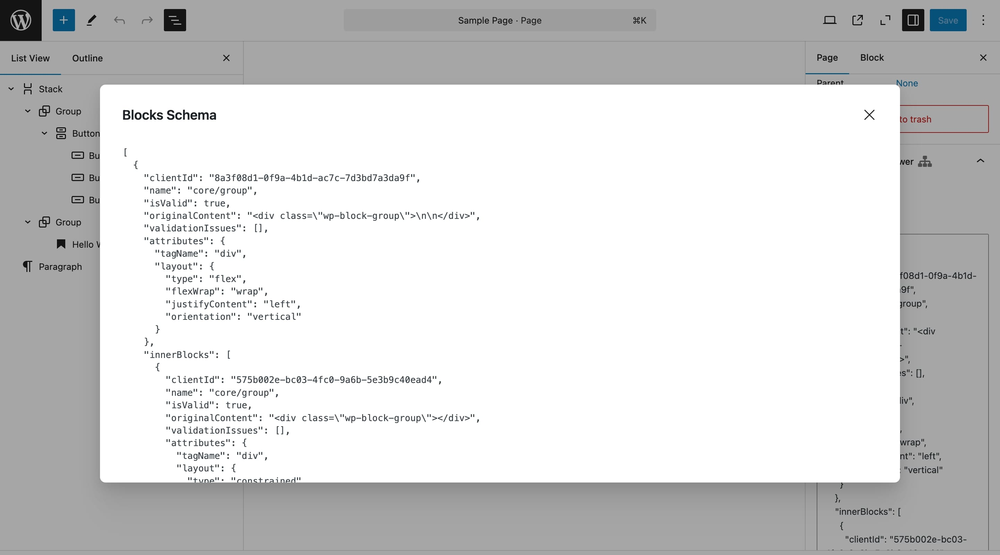

# Blocks Schema Viewer

A tiny WordPress plugin to display the JSON representation of all blocks on the current page within the Gutenberg editor for debugging and analysis.

## Motivation

This plugin was created to provide developers -- well mostly me, but I hope you will find it useful as well -- with a simple and effective tool to inspect the JSON representation of all blocks on a page. When developing custom blocks using core blocks, it allows developers to quickly see how the blocks are structured in JSON format. It also makes it easier to understand how block data is stored when parsing and analyzing blocks on the server side with PHP.

## Screenshots

## Changelog

- 0.1.0 Initial release.
- 0.2.0 Add `json-viewer` web component.
